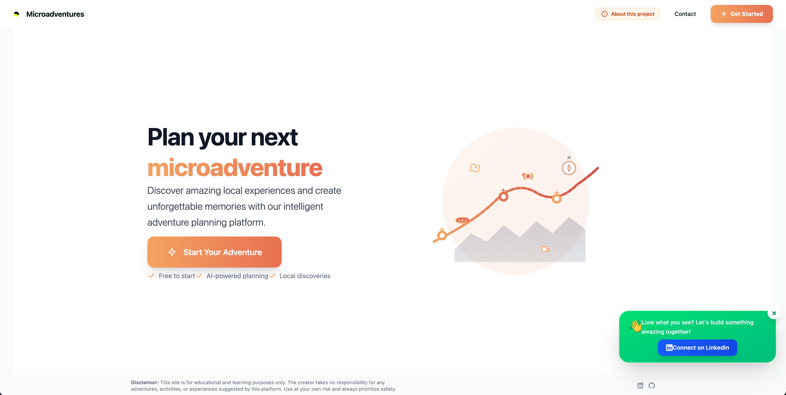
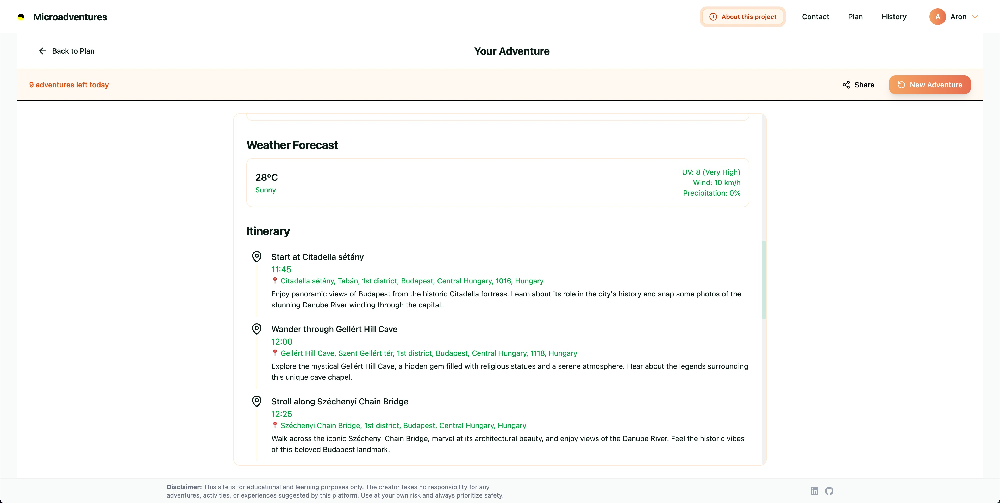

# Microadventures

**AI-powered micro-adventure planning application** that helps you discover short, exciting trips from a few hours to a few days, tailored to your location, time constraints, and current weather conditions. This project is a full-stack application built with a modern, cloud-native architecture, designed to be a portfolio piece showcasing a wide range of skills and technologies.

## ☁️ Production Environment

The application is live at [**microadventures.aronhedl.com**](https://microadventures.aronhedl.com). Feel free to try it out!

In production, **Cloudflare** is used as a reverse proxy, CDN, and for DNS management. This provides:
- **Performance**: Caching static assets closer to users, reducing latency.
- **Security**: Protection against DDoS attacks and other malicious traffic.
- **SSL/TLS**: Free and automated SSL/TLS certificates.

## ✨ Features

- 🤖 **AI-Powered Planning**: Generate personalized adventure recommendations using OpenAI GPT-3.5-turbo.
- 🗺️ **Interactive Maps**: Visual trip planning with Leaflet (OpenStreetMap) integration. No Google Maps required—fully open-source and privacy-friendly.
- 🌤️ **Weather Integration**: Real-time weather considerations for optimal planning.
- 📱 **Responsive Design**: Beautiful, mobile-first interface built with React and Tailwind CSS.
- 👤 **User Authentication**: Secure JWT-based authentication system.
- 📊 **Adventure History**: Track and revisit your past adventures.
- 🔗 **Adventure Sharing**: Share your adventures with others via public links.
- ☁️ **Cloud Native**: Production-ready Kubernetes deployment with GitOps.

## 📖 Documentation

- 📘 [Backend README](components/backend/README.md)
- 📗 [Frontend README](components/frontend/README.md)
- 📙 [Kubernetes README](k8s/README.md)
- 📕 [Initial Setup README](initial-setup/README.md)

## 🛠️ Technology Stack

This project uses a modern, robust, and high-performance technology stack to solve complex problems efficiently.

### Frontend
- **React 19**: For building a fast, modern, and responsive user interface.
- **Vite**: As a next-generation frontend build tool for a fast development experience.
- **Tailwind CSS**: For a utility-first CSS workflow, enabling rapid UI development.
- **Leaflet + OpenStreetMap**: For interactive, modern, and free maps. No Google Maps API key needed.
- **Axios**: For making HTTP requests to the backend.

### Backend
- **FastAPI**: A modern, fast (high-performance) web framework for building APIs with Python 3.13.
- **PostgreSQL**: As the primary relational database.
- **SQLAlchemy**: As the ORM for interacting with the database.
- **Alembic**: For database migrations.
- **Pydantic**: For data validation.
- **JWT**: For secure user authentication.

### Infrastructure & DevOps
- **Docker**: For containerizing the frontend and backend applications.
- **Kubernetes (K8s)**: For container orchestration, enabling scalable and resilient deployments.
- **Kind**: For local Kubernetes development.
- **GKE (Google Kubernetes Engine)**: For production deployments on Google Cloud.
- **Kluctl**: For a GitOps approach to Kubernetes deployments.
- **Devbox**: For creating isolated development environments with Nix.
- **Task**: As a task runner and build tool.
- **Pre-commit**: For running linters and formatters before committing code.
- **GitHub Actions**: For continuous integration and continuous deployment (CI/CD).
- **Trivy**: For vulnerability scanning of container images.

- **Cloudflare**: For DNS, CDN, and security.

## 🧑‍💻 Development Lifecycle

This project was developed with a strong emphasis on modern software development practices and a robust DevOps culture.

### Local Development
- **Devbox**: `devbox.json` defines the development environment, ensuring all developers have the same tools and versions. `devbox shell` creates an isolated environment with all the necessary dependencies.
- **Tilt**: `Tiltfile` provides a live development environment for Kubernetes. It automatically builds and deploys services as you make changes to the code.
- **Task**: `Taskfile.yaml` files are used to automate common development tasks like running tests, linting, and building the application.

### Testing
- **Frontend**: `vitest` is used for unit and integration testing of React components.
- **Backend**: `pytest` is used for unit and integration testing of the FastAPI application.
- **CI**: GitHub Actions runs all tests automatically on every push and pull request.

### Linting and Formatting
- **Pre-commit**: `.pre-commit-config.yaml` is configured to run linters and formatters before each commit, ensuring code quality and consistency.
- **Ruff**: For linting and formatting Python code.
- **ESLint** and **Prettier**: For linting and formatting JavaScript/React code.

### CI/CD
- **GitHub Actions**: Chosen for its tight integration with GitHub, making it easy to set up automated workflows. It's used to run tests on every push and pull request, build and push Docker images, and trigger deployments.
- **Kluctl**: Chosen for its GitOps capabilities. It allows for the desired state of the Kubernetes cluster to be defined declaratively in Git. The CI/CD pipeline uses Kluctl to apply these configurations, ensuring that the cluster always matches the state defined in the repository. This provides a single source of truth and a clear audit trail for all changes.

### AI-Assisted Development
Throughout the development of this project, I have intensively used the following AI models to assist with coding, debugging, and documentation:
- **Anthropic Sonnet 4**
- **GPT-4.1**
- **Gemini 2.5**

## 🚀 Getting Started

To get started with this project, please refer to the [Initial Setup README](initial-setup/README.md).

## 📸 User Stories & Screenshots

Here are a few ways users interact with Microadventures:

- **"As a busy professional, I want to find a half-day adventure near me, so I can recharge without taking time off work."**
- **"As a family, we want to discover weekend trips that are safe and fun for kids, with real-time weather info."**
- **"As an outdoor enthusiast, I want to share my favorite microadventures with friends via a simple link."**

Showcase Screenshots

<!-- Add more screenshots or GIFs as needed -->

## Screenshots

See more screenshots and demo GIFs in [screenshots/README.md](screenshots/README.md).

## 🏆 CI/CD & Security Pipeline Highlights

- **Automated Testing:** All backend and frontend tests run on every push and pull request using GitHub Actions.
- **Test Coverage Reporting:** Coverage results are posted in the GitHub Actions summary for every build.
- **Secret Scanning:** [TruffleHog](https://github.com/trufflesecurity/trufflehog) scans for secrets in code and PRs, failing the build if any are found (with robust ignore logic).
- **Container Security:** [Trivy](https://github.com/aquasecurity/trivy) scans Docker images for vulnerabilities, with only actionable findings posted in the summary.
- **Pre-commit Hooks:** Linting and formatting for Python and JS/React code before every commit.
- **GitOps Deployments:** All Kubernetes changes are applied declaratively via Kluctl, ensuring a single source of truth and auditability.
- **Cloudflare Security:** DDoS protection, SSL, and CDN for production traffic.

## � What I Learned / Key Challenges

- **Modern CI/CD:** Built a robust pipeline with test, coverage, secret scanning, and container security, all surfaced in PRs for fast feedback.
- **Cloud-Native Deployment:** Learned GitOps with Kluctl and managed multi-environment Kubernetes deployments (local, GKE, production).
- **AI Integration:** Integrated multiple LLMs (OpenAI, Anthropic, Gemini) for adventure generation, handling prompt engineering and API rate limits.
- **Security Best Practices:** Implemented secret scanning, rate limiting, and secure secret management with External Secrets Operator and GCP Secret Manager.
- **Developer Experience:** Used Devbox, Tilt, and Task to ensure fast, reproducible local development and onboarding.
- **Resilience:** Made CI steps robust to missing files, flaky tests, and external API failures, ensuring reliable builds.

Feel free to reach out to me on [LinkedIn](https://www.linkedin.com/in/hedlaron/).

---

> _This project is designed as a portfolio piece to showcase full-stack, cloud-native, and DevOps skills. For more screenshots, see the [`screenshots/`](screenshots/) folder._

## 🙏 Acknowledgments

- **Sid from DevOps Directive** ([sidpalas](https://github.com/sidpalas/)) for excellent DevOps and Kubernetes tutorials.

## 📄 License

This project is licensed under the MIT License - see the [LICENSE](LICENSE) file for details.
